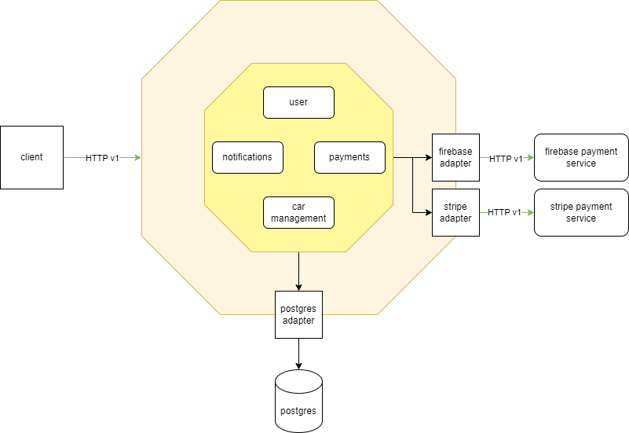

# DriverGO
DriverGO - is a Golang realization of car rental service, built according to a Monolithic Architecture.

## Backend Tech Stack
- PostgreSQL
- HTTP/Fiber
- Gomock (Mocks)
- JWT Authentication
- Docker-compose
- Zap (Logging)
- Testcontainers (Tests)
- Prometheus/Grafana (Metrics)

## Features
- Project wrote according to Bob Bowman`s clean architecture
- All routes are optimised (less than 100ms to respond)
- Most of the code is covered with UNIT-tests
- Code follows SOLID principles

## External services usage:
- Stripe
- Firebase

## App architecture:
